# fairgate

[Website](https://fairgate.de/verbandslosung/)

## Stammdatenpflege

[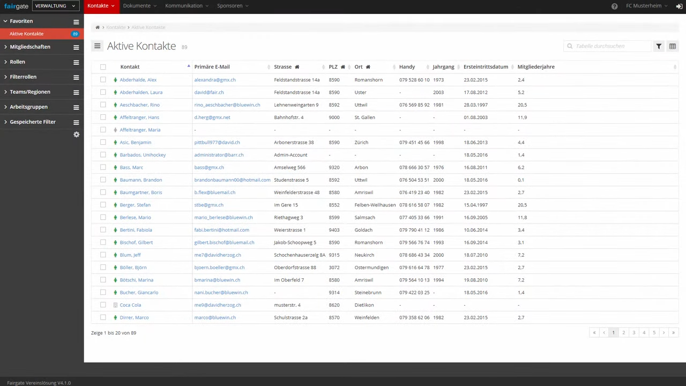{ width="500" }](assets/fairgate/stammdatenpflege_uebersicht.png)

[Quelle](https://fairgate.de/mitgliederverwaltung-kontaktverwaltung/)

### Mitglied

[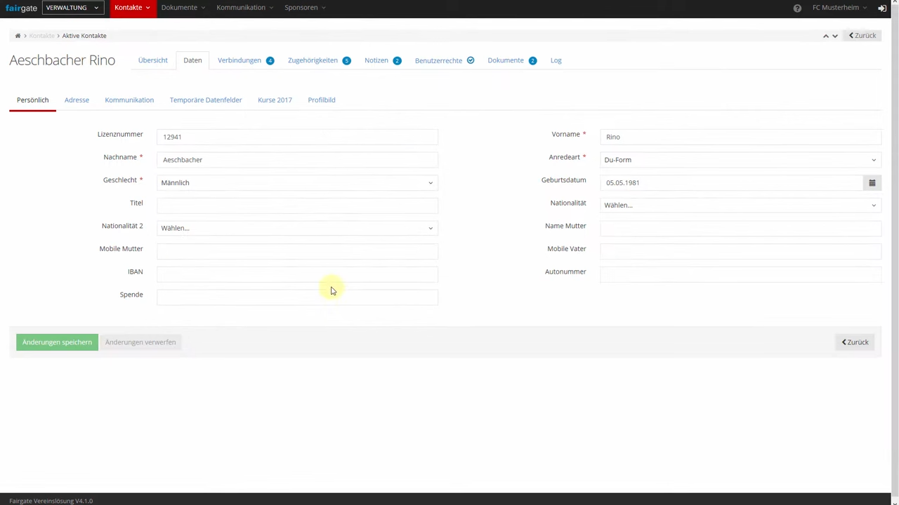{ width="500" }](assets/fairgate/stammdatenpflege_mitglied.png)

[Quelle](https://fairgate.de/mitgliederverwaltung-kontaktverwaltung/)

[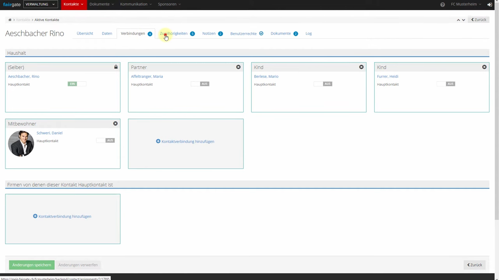{ width="500" }](assets/fairgate/stammdatenpflege_mitglied_beziehungen.png)

[Quelle](https://fairgate.de/mitgliederverwaltung-kontaktverwaltung/)

### Eigene Felder

[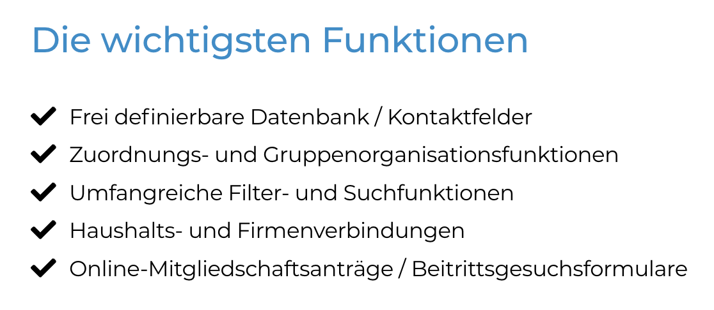{ width="500" }](assets/fairgate/stammdatenpflege_eigene_felder.png)

[Quelle](https://fairgate.de/mitgliederverwaltung-kontaktverwaltung/)

### Nachweisverwaltung

[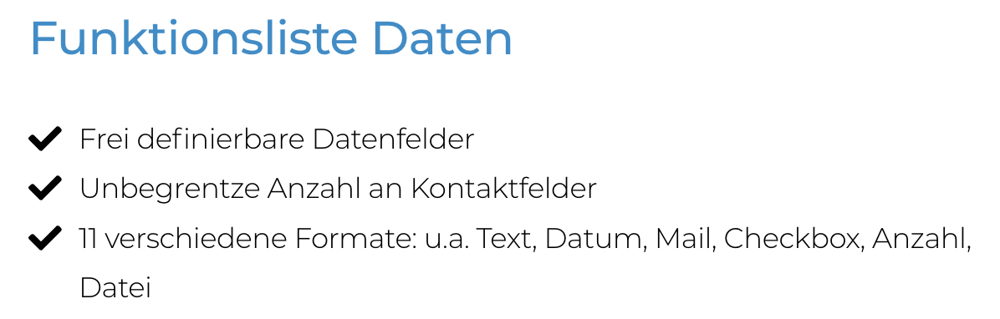{ width="500" }](assets/fairgate/stammdatenpflege_nachweise.png)

[Quelle](https://fairgate.de/mitgliederverwaltung-kontaktverwaltung/)

## Mailversand

[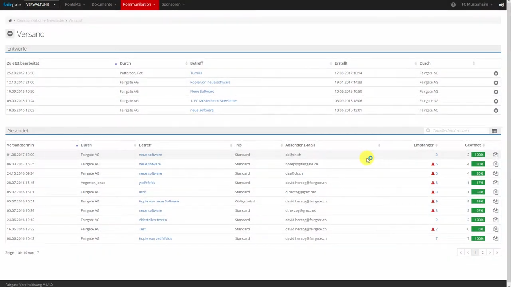{ width="500" }](assets/fairgate/mailversand_uebersicht.png)

[Quelle](https://fairgate.de/kommunikation-newsletter-nachrichten/)

[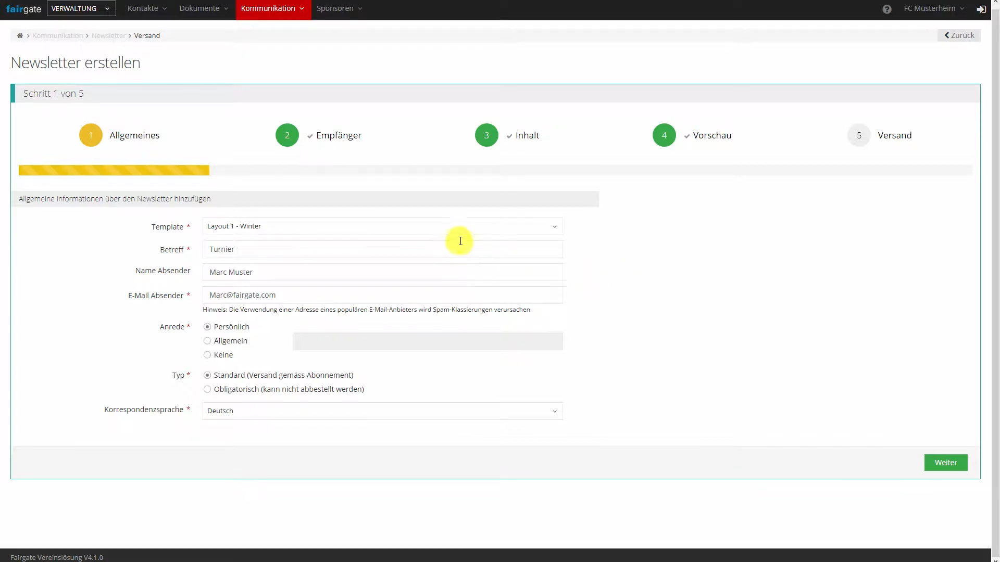{ width="500" }](assets/fairgate/mailversand_step1.png)

[Quelle](https://fairgate.de/kommunikation-newsletter-nachrichten/)

[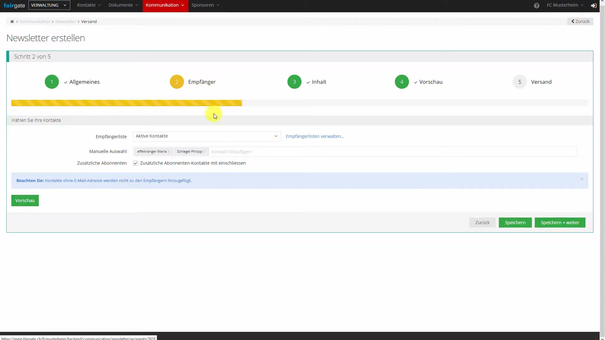{ width="500" }](assets/fairgate/mailversand_step2.png)

[Quelle](https://fairgate.de/kommunikation-newsletter-nachrichten/)

[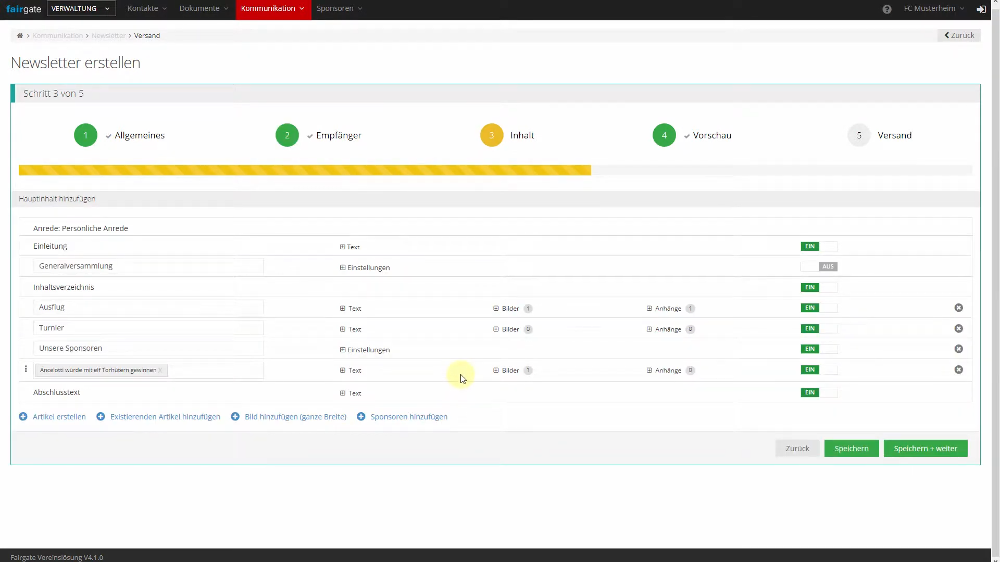{ width="500" }](assets/fairgate/mailversand_step3.png)

[Quelle](https://fairgate.de/kommunikation-newsletter-nachrichten/)

[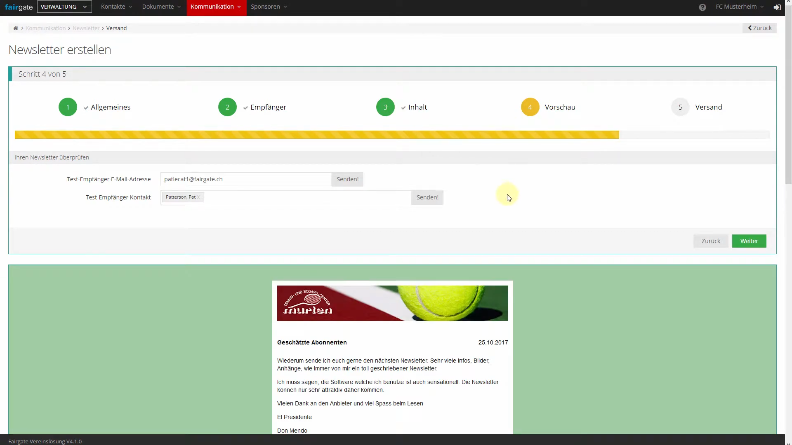{ width="500" }](assets/fairgate/mailversand_step4.png)

[Quelle](https://fairgate.de/kommunikation-newsletter-nachrichten/)

[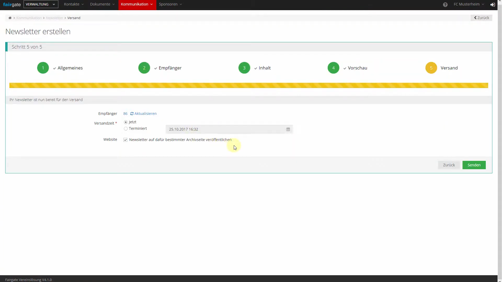{ width="500" }](assets/fairgate/mailversand_step5.png)

[Quelle](https://fairgate.de/kommunikation-newsletter-nachrichten/)

[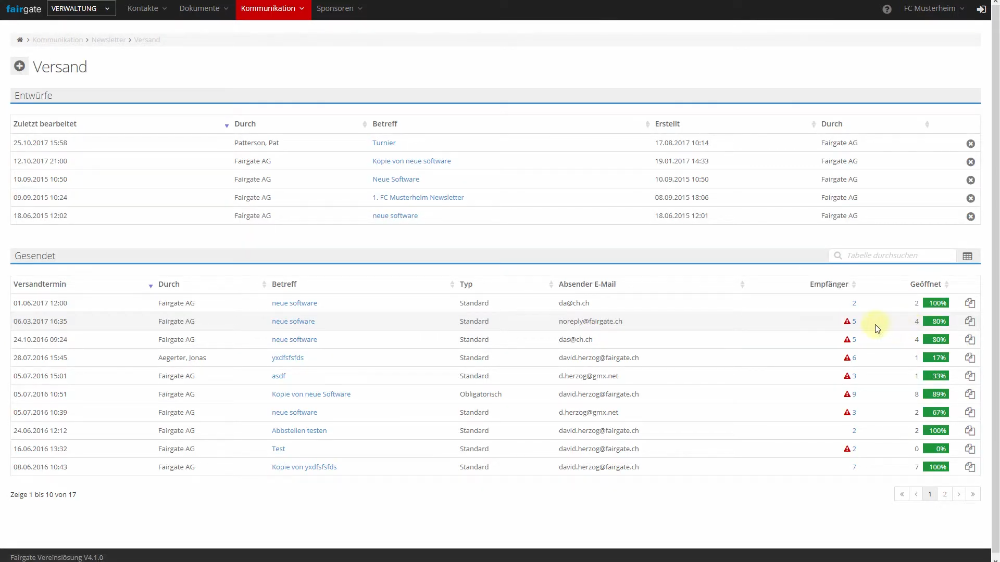{ width="500" }](assets/fairgate/mailversand_statistik.png)

[Quelle](https://fairgate.de/kommunikation-newsletter-nachrichten/)

### Vorlagen

[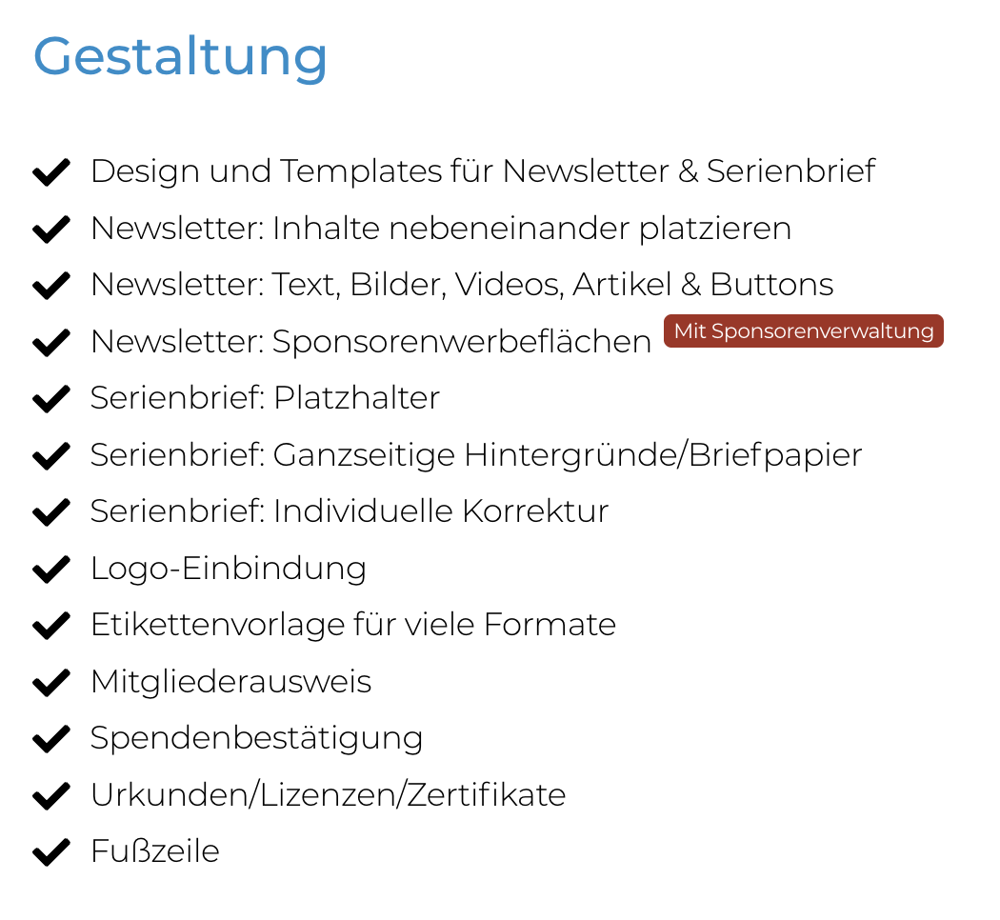{ width="500" }](assets/fairgate/mailversand_vorlagen.png)

[Quelle](https://fairgate.de/kommunikation-newsletter-nachrichten/)

## Externe Kontakte

[{ width="500" }](assets/fairgate/externe_kontakte_uebersicht.png)

[Quelle](https://fairgate.de/mitgliederverwaltung-kontaktverwaltung/)

## Mitgliedsbeiträge

[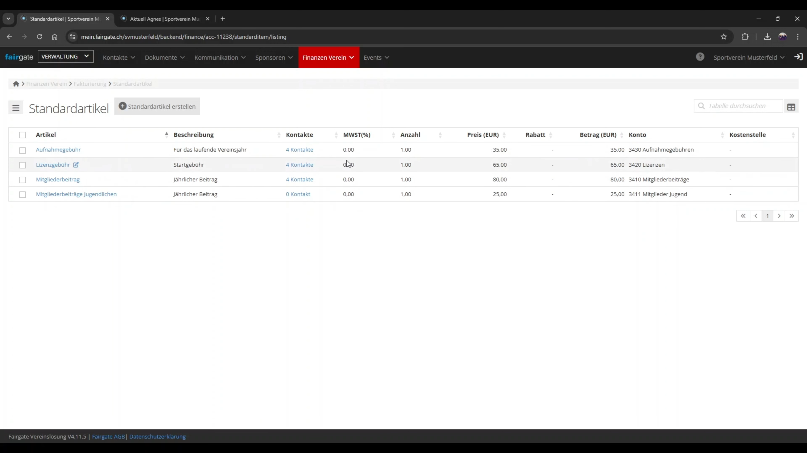{ width="500" }](assets/fairgate/mitgliedsbeitraege_uebersicht.png)

[Quelle](https://fairgate.de/finanzen/)

[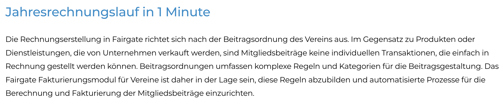{ width="500" }](assets/fairgate/mitgliedsbeitraege_uebersicht_details.png)

[Quelle](https://fairgate.de/finanzen/)

### Wiederkehrende Beiträge

Im Erklär-Video wird es so gezeigt als müsste man es jährlich manuell anstoßen. Im Text steht, dass wiederkehrende Rechnungen automatisch erstellt werden können.

[Quelle](https://fairgate.de/finanzen/)

### Individuelle Beiträge

Im Text steht, dass Mitgliedsbeiträge von Verein zu Verein sehr individuell sind und deshalb fairgate sich an den Verein anpasst. Mit Regeln und automatisierten Prozessen sollen die Mitgliedsbeiträge eingerichtet werden können.

[Quelle](https://fairgate.de/finanzen/)

### Beitrags-Regeln

Im Text steht, dass Mitgliedsbeiträge von Verein zu Verein sehr individuell sind und deshalb fairgate sich an den Verein anpasst. Mit Regeln und automatisierten Prozessen sollen die Mitgliedsbeiträge eingerichtet werden können.

[Quelle](https://fairgate.de/finanzen/)

### Beitrags-Einzug

[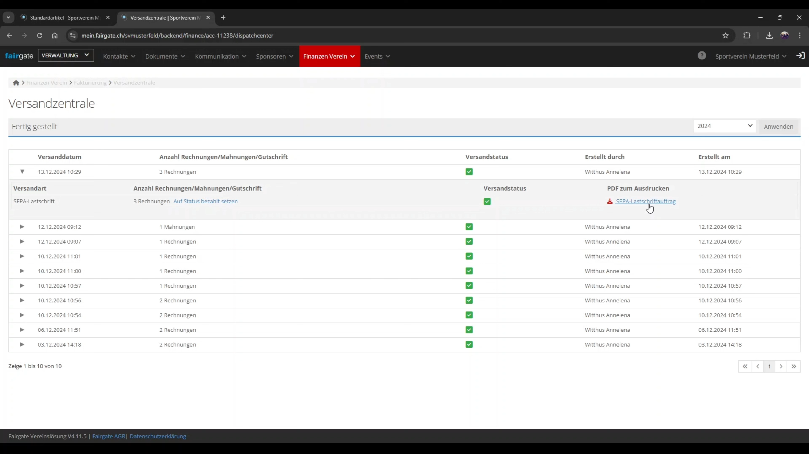{ width="500" }](assets/fairgate/mitgliedsbeitraege_einzug.png)

[Quelle](https://fairgate.de/finanzen/)

## Rollen / Rechte

[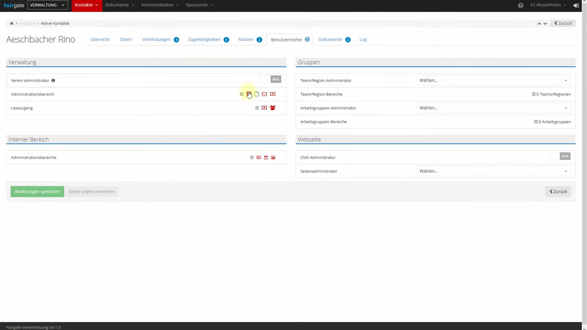{ width="500" }](assets/fairgate/rollen_rechte.png)

[Quelle](https://fairgate.de/mitgliederverwaltung-kontaktverwaltung/)

## Gruppen / Teams

[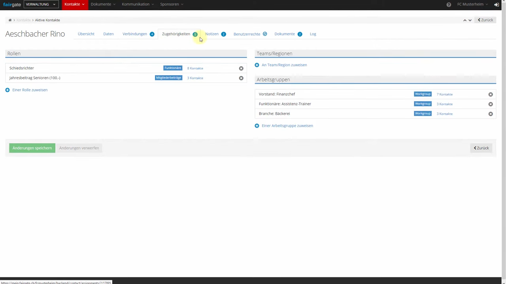{ width="500" }](assets/fairgate/gruppen.png)

[Quelle](https://fairgate.de/mitgliederverwaltung-kontaktverwaltung/)

## Mitgliedsantrag

[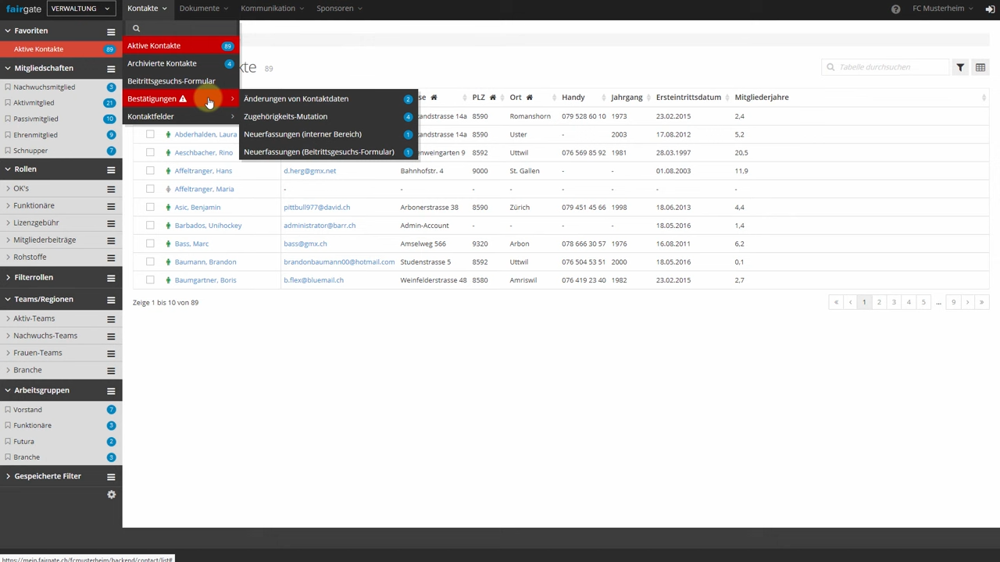{ width="500" }](assets/fairgate/mitgliedsantrag.png)

[Quelle](https://fairgate.de/mitgliederverwaltung-kontaktverwaltung/)

## Mitgliederstatistiken

Auf der Website wurde dazu nichts gefunden, nur im Erklär-Video von den Veranstaltungen ein Screenshot erhascht.

[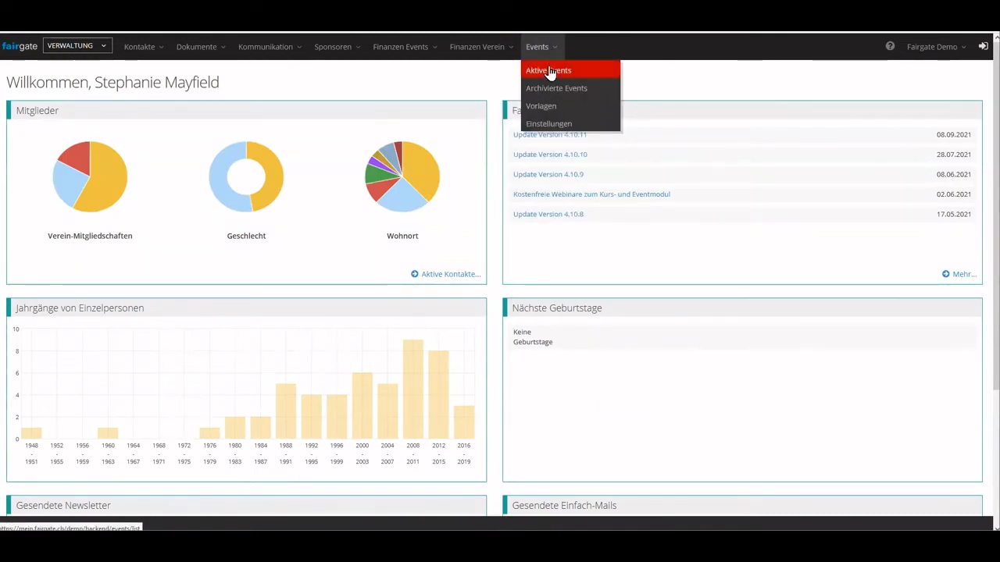{ width="500" }](assets/fairgate/mitglieder_statistik.png)

[Quelle](https://fairgate.de/kurs-und-eventmodul/)

## Datensatzsuche

[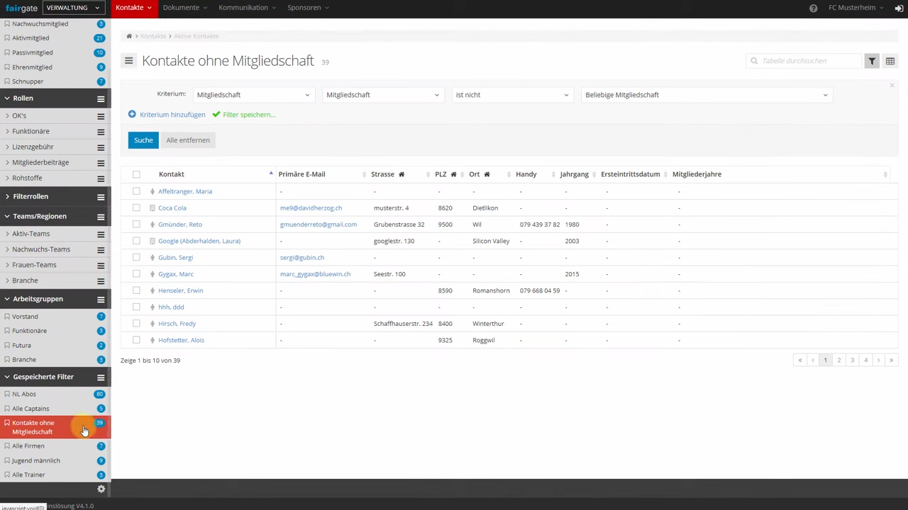{ width="500" }](assets/fairgate/filter_suche.png)

[Quelle](https://fairgate.de/mitgliederverwaltung-kontaktverwaltung/)

## Kassenmodul

### Zahlungen

Details müssen noch geprüft werden.

### Belege

Details müssen noch geprüft werden.

### Buchführung

#### Buchen

Details müssen noch geprüft werden.

#### Filtern

Details müssen noch geprüft werden.

#### Kostenstellen

[{ width="500" }](assets/fairgate/kassenmodul_kostenstellen.png)

[Quelle](https://fairgate.de/finanzen/)

[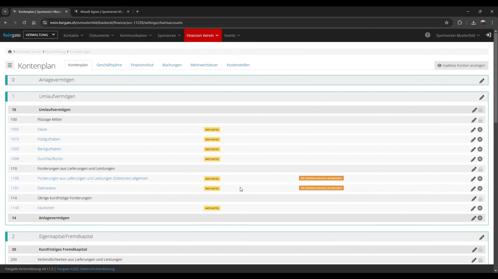{ width="500" }](assets/fairgate/kassenmodul_kontenplan.png)

[Quelle](https://fairgate.de/finanzen/)

[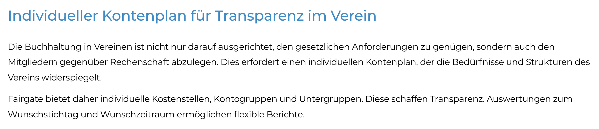{ width="500" }](assets/fairgate/kassenmodul_kontenplan_details.png)

[Quelle](https://fairgate.de/finanzen/)

#### Split-Buchungen

[{ width="500" }](assets/fairgate/kassenmodul_split_buchungen.png)

[Quelle](https://fairgate.de/finanzen/)

#### Auswertungen

Details müssen noch geprüft werden.

### Rechnungsstellung

#### Rechnungsvorlagen

Text- und Layout-Vorlagen.

[Quelle](https://fairgate.de/finanzen/)

#### Massenrechnungen

[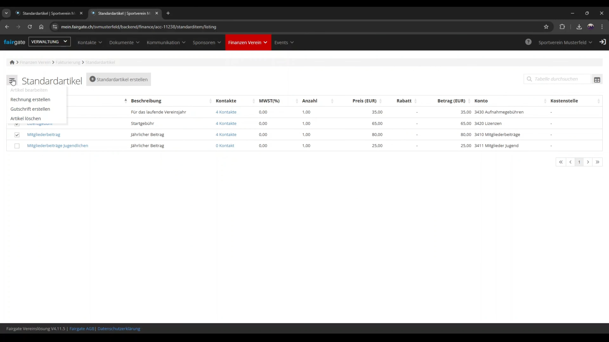{ width="500" }](assets/fairgate/kassenmodul_massenrechnungen.png)

[Quelle](https://fairgate.de/finanzen/)

#### Rechnungsstatus

[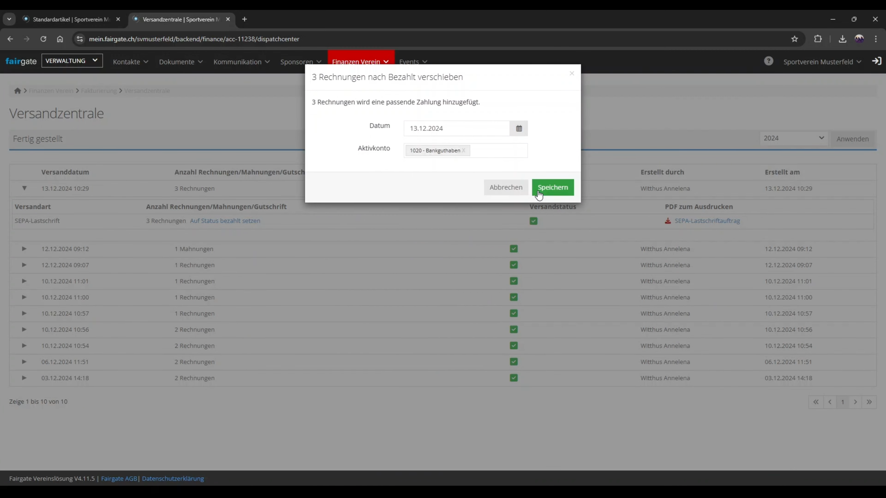{ width="500" }](assets/fairgate/kassenmodul_rechnungsstatus.png)

[Quelle](https://fairgate.de/finanzen/)

#### Mahnungen

[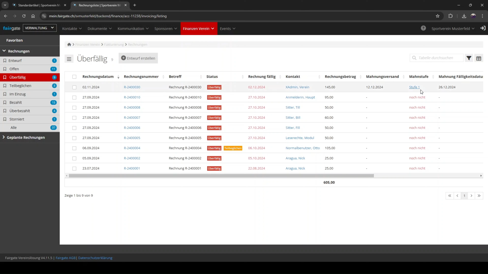{ width="500" }](assets/fairgate/kassenmodul_mahnungen.png)

[Quelle](https://fairgate.de/finanzen/)

## Veranstaltungsmodul

[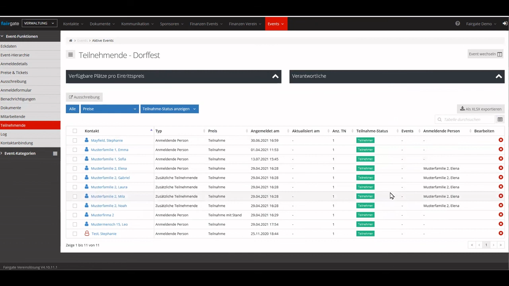{ width="500" }](assets/fairgate/veranstaltungsmodul_uebersicht.png)

[Quelle](https://fairgate.de/kurs-und-eventmodul/)

[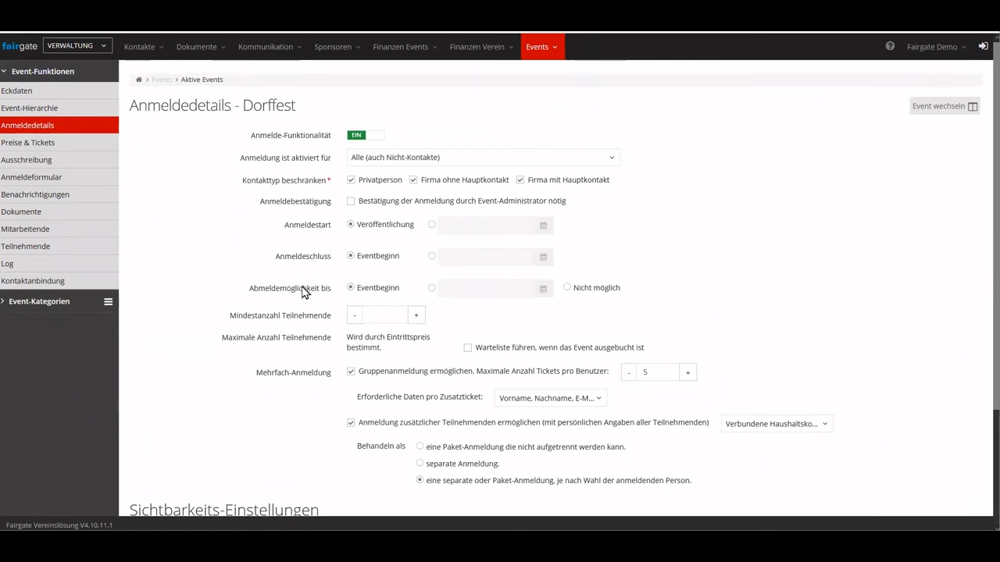{ width="500" }](assets/fairgate/veranstaltungsmodul_daten.png)

[Quelle](https://fairgate.de/kurs-und-eventmodul/)

### Anmeldeformulare

[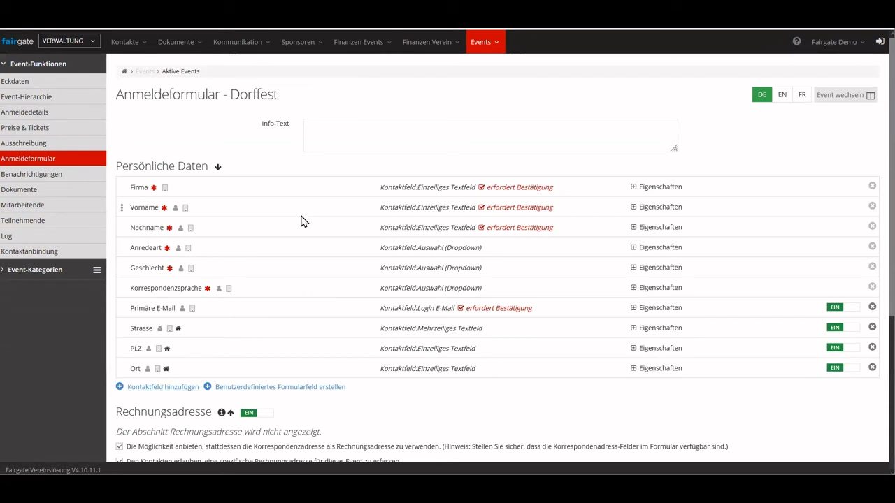{ width="500" }](assets/fairgate/veranstaltungsmodul_anmeldeformulare.png)

[Quelle](https://fairgate.de/kurs-und-eventmodul/)

### Datenverwaltung

[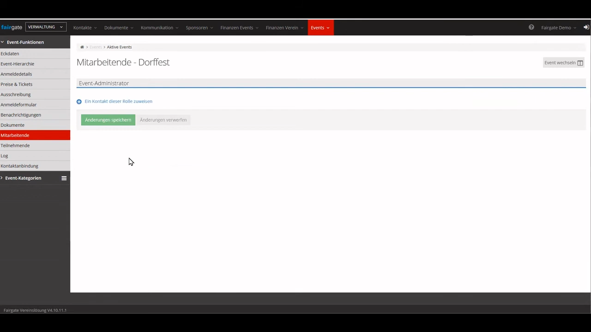{ width="500" }](assets/fairgate/veranstaltungsmodul_datenverwaltung.png)

[Quelle](https://fairgate.de/kurs-und-eventmodul/)

### Rechnungsstellung

[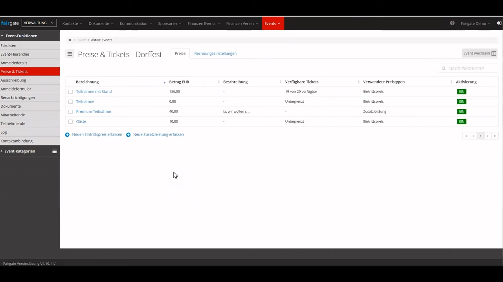{ width="500" }](assets/fairgate/veranstaltungsmodul_beitrag.png)

[Quelle](https://fairgate.de/kurs-und-eventmodul/)

### Anbindungen

#### Website

[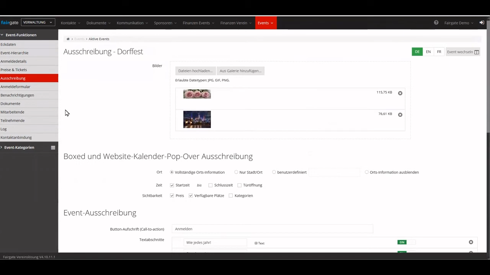{ width="500" }](assets/fairgate/veranstaltungsmodul_anbindung_website.png)

[Quelle](https://fairgate.de/kurs-und-eventmodul/)
