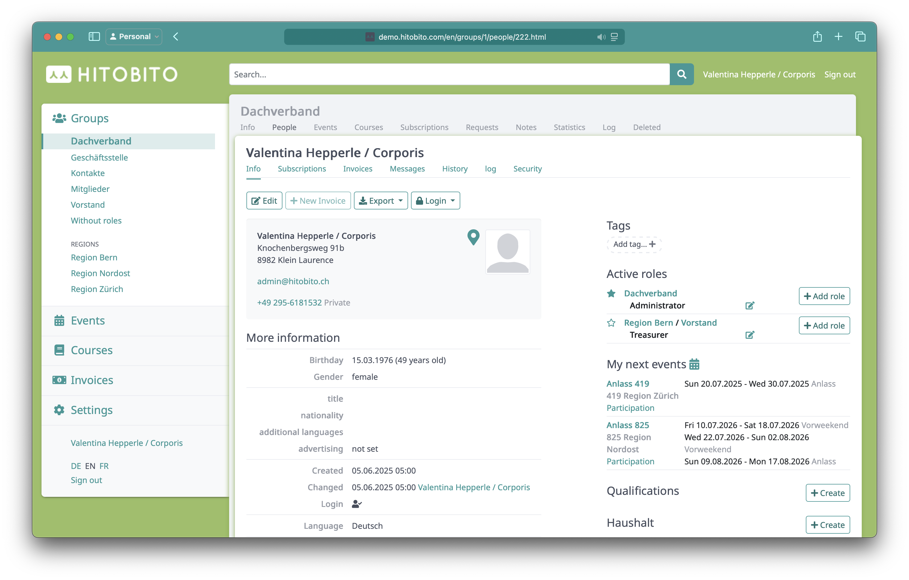

# Hitobito

  

[Website](https://hitobito.com/de/)

[Anleitung](https://hitobito.readthedocs.io/de/latest/)

[Demo](https://hitobito.com/de/kostenlos-testen)

[DPSG - NaMi 3.0 Zwischenstand](https://ncm.dpsg.de/nami3/)

- NaMi 3.0
  - Es wird ein neues Tool geben. NaMi soll moderner, benutzer*innenfreundlicher und effizienter werden – und dabei war auch eure Unterstützung wichtig! Eine Projektgruppe arbeitet derzeit fleißig an der Umsetzung einer neuen Mitgliederverwaltung. Hierfür wurde im letzten Jahr eine Umfrage durchgeführt. Weitere Infos findet ihr auf [https://ncm.dpsg.de/nami3/](https://ncm.dpsg.de/nami3/). Anhand der Ergebnisse wurde geschaut, welche Lösung die diversen Wünsche und Bedarfe aus dem Verband am besten abdeckt. Seit kurzem ist entschieden, dass wir eine webbasierte Open Source Lösung mit [Hitobito](https://hitobito.com/de/) anstreben. Die Lösung soll im Jahr 2026 für euch verfügbar sein.

## Stammdatenpflege

[{ width="500" }](assets/hitobito/stammdatenpflege_uebersicht.png)

[Quelle](https://demo.hitobito.com/en/groups/5/people?returning=true)

### Mitglied

[{ width="500" }](assets/hitobito/stammdatenpflege_mitglied.png)

[Quelle](https://demo.hitobito.com/en/groups/1/people/222.html)

## Zusätzliche Funktionen

- [API](https://demo.hitobito.com/en/groups/5/service_tokens){ target="_blank" }
