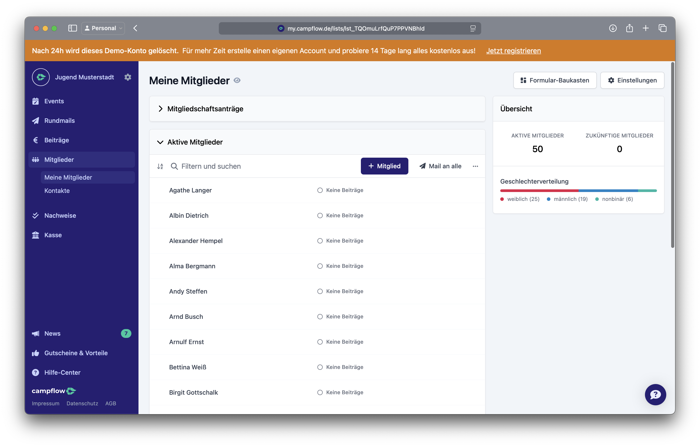

---
search:
  boost: 0.5 # rank down in search
---

# Übersicht

  

## Aktuell in der engeren Auswahl

- [campai](./campai.md)

    [{ width="500" }](assets/campai/stammdatenpflege_uebersicht.webp)

- [campflow](./campflow.md)

    [{ width="500" }](assets/campflow/stammdatenpflege_uebersicht.png)

- [fairgate](./fairgate.md) - noch per Demoversion genauer zu testen

    [{ width="500" }](assets/fairgate/stammdatenpflege_uebersicht.png)

- ([Hitobito](./hitobito.md) - DPSG)

    [{ width="500" }](assets/hitobito/stammdatenpflege_uebersicht.png)

## Anforderungskatalog

Kann über separaten Link eingesehen werden.

## Tool-Landschaft

